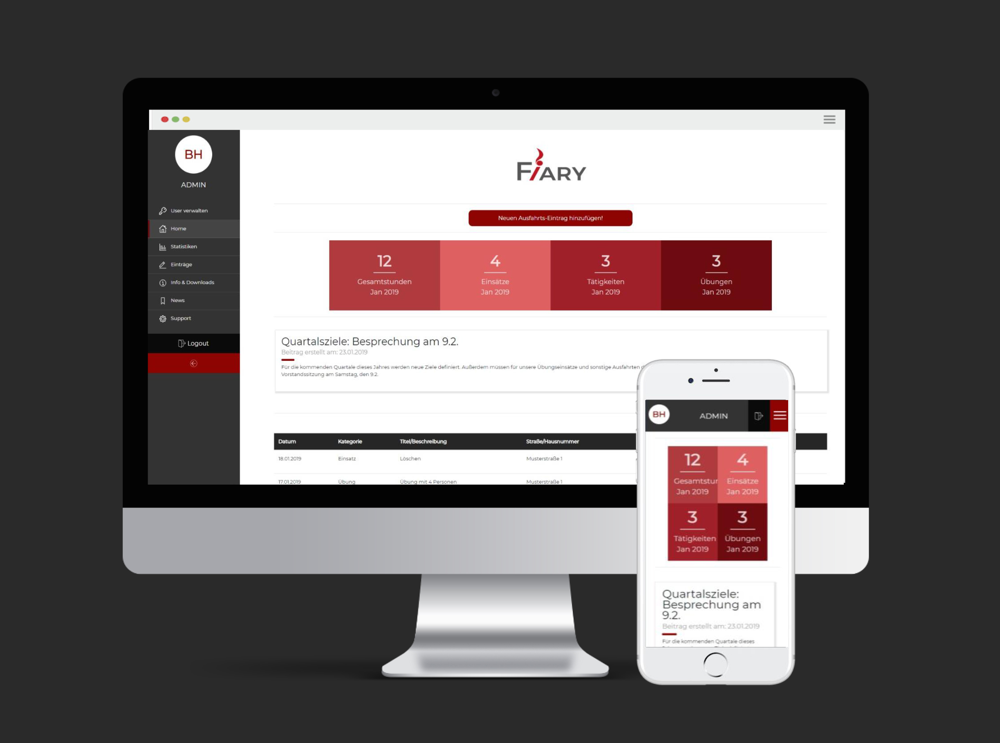
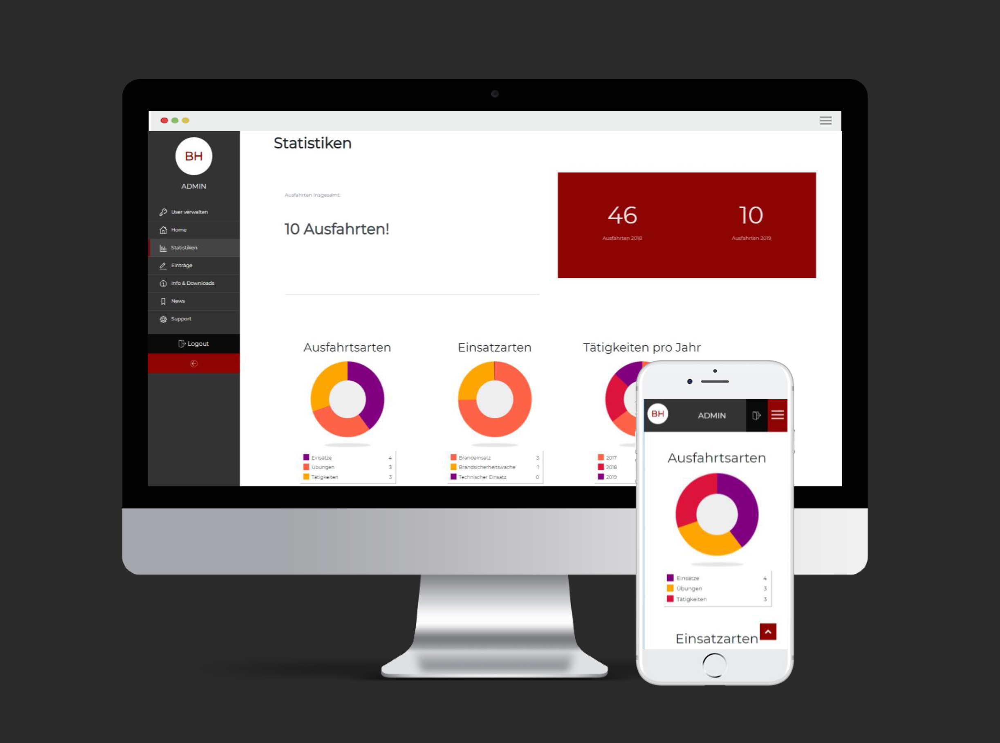
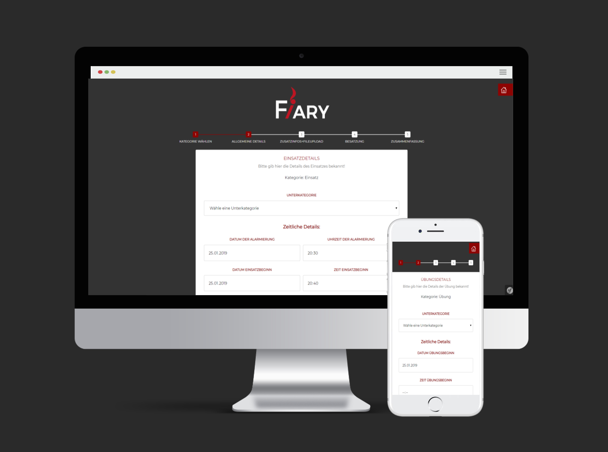
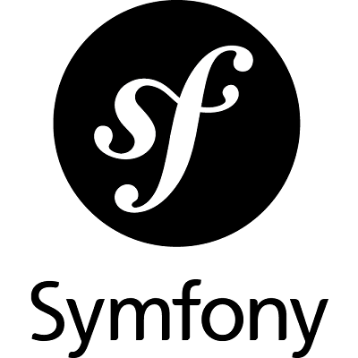

# Fiary
## Fire Reporting System

### Project Description
This repository contains the code for Fiary, a web application developed as a fifth-semester project of the Media Technology and Design Bachelor's degree programme in 2018. 
Fiary is a new administration tool for the Fire Brigade Biberbach in Lower Austria that serves as a replacement for the outdated fire reporting system that is no longer usable.

The web application simplifies the administration of the operations, exercises, and activities of the fire brigade. 
It also generates PDF files, which are later fed into the Austria-wide system.
This will ensure that the fire brigade's activities are recorded and tracked at a national level, allowing for better coordination and resource allocation. 
The PDF files will also be accessible to the public and other relevant stakeholders, providing transparency and accountability for the fire brigade's activities.

Feature List
* Documentation: document operations, exercises and acitivies
* PDF Generation
* Statistics Generation
* Administrative Tasks and Content Maintenance:
  - Manage member lists, house lists and other documents
  - Manage the users of the platform, ensuring that only authorized personnel have access
  - Create news articles to share updates and information with fellow members
* Support Form: report possible issues to the development team

### Project Requirements
The backend was developed using the Symfony framework, following the standard MVC pattern. Data is stored in a MySQL database using REST and ORM Mapping. 
The frontend was developed using Twig Templating, CSS and Bootstrap.
Some JavaScript was also used for smaller animations and the display and export of database tables.

<table>
  <tr>
    <td style="border:none;"></td>
    <td style="border:none;"></td>
    <td style="border:none;"></td>
    <td style="border:none;"></td>
    <td style="border:none;"></td>
  </tr>
</table>

### Project Contributers
Concept by Birgit Haselmayr, Isabella Molterer and Natascha Rammelmüller

Frontend Developer: Natascha
Fullstack Developer: Isabella
Backend Developer: Birgit

### My Project Responsibilities

Design: 
* Conceptualizing the initial design draft with a responsive design

Development:
* Initial Project Setup
* Authentication and Permissions: 
    - Implementing authentication logic 
    - Setting up a permission system for different user groups (read-only, editor, administrator).
* Frontend Features: 
    - Added navigation and news section 
    - Styling of the information and download area,
    - Generating tables to display operation entries providing features for pagination, sorting and export
* Backend Features: 
    - User administration functionality (create and edit users)
    - Passwort Reset functionality
    - PDF Generation 
* User Testing: Repeated testing to ensure the system's functionality and usability.
